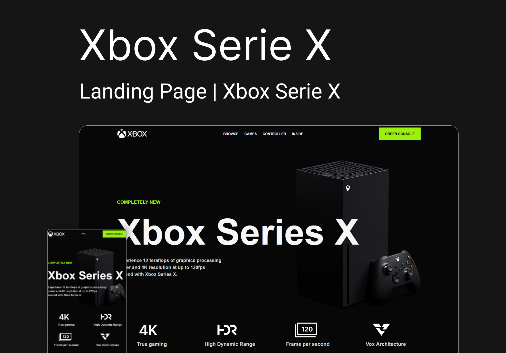

<div align="center">

  # Xbox Serie X
  
  <p>Landing Page apresentação Xbox Serie X</p>
  
   &nbsp;
   &nbsp;
   &nbsp;
   &nbsp;

  
</div>

<div>

  # ⚡ Overview
  LP | Xbox Serie X: Landing page é uma página para apresentação do novo console Xbox Serie X e suas features e melhorias.
  O layout foi desenvolvido pelo UI Designer Jonas Milan,
   
  ## Features:
  - Manipulação de DOM
  - Fidelidade ao layout original;
  - Totalmente Responsivo
  - SEO otimizado
  - W3C validação
  - Animações suaves
  - Animações de entradas com lib AOS JS.
  - Página com carregamento rápido
  - Página Home | Styleguide
  - Layout Clean e Moderno

  # 📚 Aprendizados
  Usar animações de efeitos entrada com biblioteca AOS, imagens em camadas (z-index)<br />
  Uso de tipografia que combine com o projeto.

  # 🚀 [Ver online](https://xbox-serie-x.softwarealles.repl.co/)

  ## 👽 Clone

  ```
  git clone git@github.com:DiogoRealles/xbox-serie-x.git
  ```
</div>


<footer>
  <p>Gostou? deixa seu like!</p>
  <p>Estou disponível para realizar seus projetos</p>
  <a href="mailto:diogorealles@hotmail.com"></a>
  <a href="https://www.linkedin.com/in/diogorealles/"></a>
  
  <p><strong>Diogo Realles | 2024</strong></p>
</footer>
